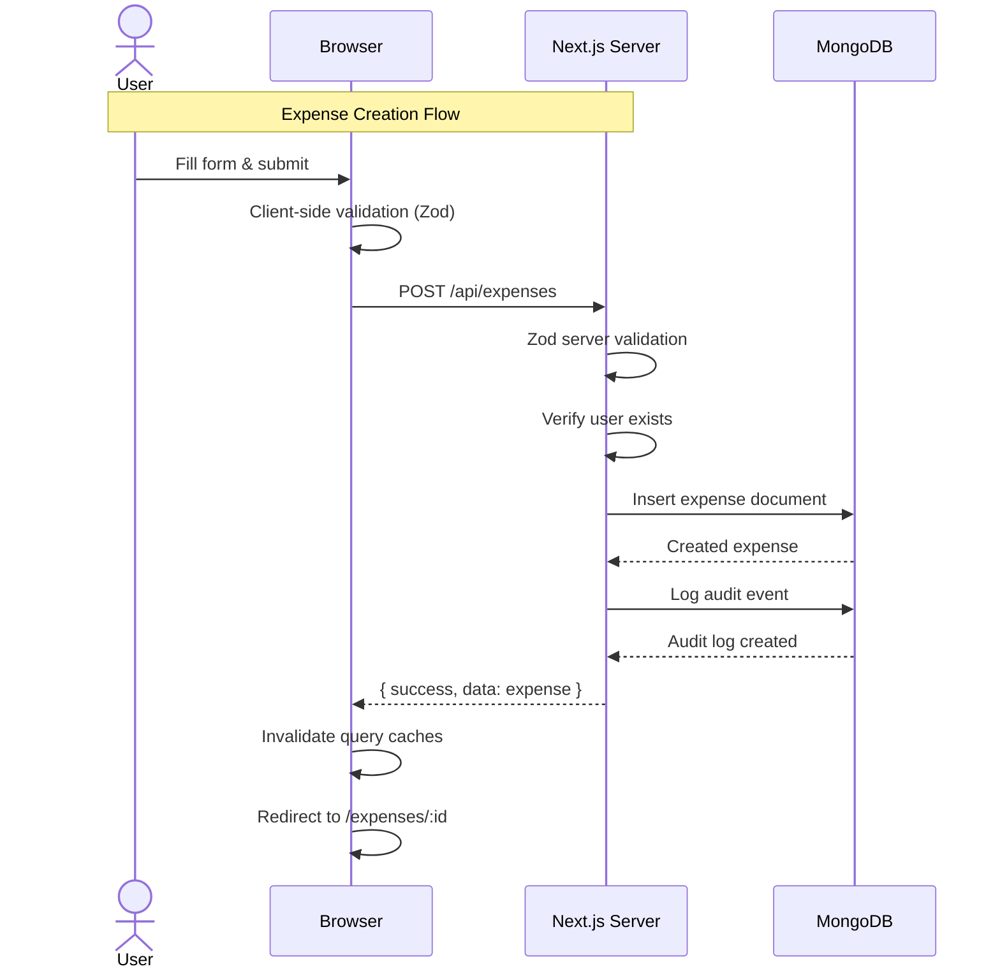

# API Documentation

All APIs return `{ success, data }` or `{ success, error }`.

## Auth APIs

### `POST /api/auth/signup`

- Auth: No
- Body: `{ name, username, password }`
- Response: `{ id, name, username }`

### `POST /api/auth/login`

- Auth: No
- Body: `{ username, password }`
- Response: `{ id, name, username }` + auth cookie

### `POST /api/auth/logout`

- Auth: Yes
- Body: none
- Response: `{ message }`

### `GET /api/auth/me`

- Auth: Yes
- Response: `{ id, name, username }`

## Expense APIs

### `GET /api/expenses`

- Auth: Yes
- Query: `page`, `limit`, `q`, `categoryId`, `sortBy`, `order`, `from`, `to`, `amountMin`, `amountMax`
- Response: paginated expense list
- Sorting: `paidAt`, `amount`, `title` with `asc`/`desc` order

### `GET /api/expenses/:id`

- Auth: Yes
- Response: full expense detail including metadata (notes, location, images)

### `POST /api/expenses`

- Auth: Yes
- Body: `{ title, amount, categoryId, images[], location, currency, paidAt, notes? }`
- Validation: Zod `expenseSchema`
- Response: created expense with generated `_id`

### `PUT /api/expenses/:id`

- Auth: Yes
- Body: same as POST
- Response: updated expense

### `DELETE /api/expenses/:id`

- Auth: Yes
- Response: deletion confirmation

### `GET /api/categories/:id`

- Auth: Yes
- Response: category detail

### `GET /api/categories/:id/stats`

- Auth: Yes
- Query: `from`, `to`
- Response: category range stats (total, count, avg, min, max, trend)

## Category APIs

- `GET /api/categories` — list all categories
- `POST /api/categories` — create new category
- `GET /api/categories/:id` — get category detail
- `PUT /api/categories/:id` — update category
- `DELETE /api/categories/:id` — delete category
- `GET /api/categories/:id/stats` — category range statistics (requires `from`, `to` query params)

## Analytics APIs

### `GET /api/expenses/all`

- Auth: Yes
- Query: `from`, `to` (ISO datetime strings)
- Response: all expenses in the date range (unpaginated)
- Notes: Used by dashboard and category pages to compute aggregated data client-side

## Upload APIs

### `GET /api/uploads/signature`

- Auth: Yes
- Query: `publicId?` (optional deterministic public_id to sign for update flows)
- Response: signed Cloudinary payload with `timestamp`, `signature`, `apiKey`, `cloudName`, `folder`, `publicId` (if provided)
- Notes:
  - Client computes deterministic `publicId` using `buildUploadPublicId(expenseName)` before requesting signature.
  - Signature endpoint creates a signature that allows upload with the specified `public_id`.
  - Client performs client-side compression before upload if file > 5MB.

## Data Portability APIs

### `GET /api/export?type=all|expenses|categories`

- Auth: Yes
- Response: `{ data, filename, mimeType, exportedAt }`
- Includes expenses, categories, analytics metadata
- Output format is JSON only

## Additional Endpoints

### `GET /api/expenses/:id/contribution`

- Auth: Yes
- Query: `from?`, `to?`
- Response: expense contribution analytics (week/month/year totals, category breakdown, monthly trend)

## Audit APIs

### `GET /api/audit`

- Auth: Yes
- Query: `page`, `limit`, `action`, `from`, `to`
- Response: paginated audit log list

## Error Responses

- Common status codes: `400`, `401`, `404`, `409`, `500`
- Common error codes: `VALIDATION_ERROR`, `NOT_FOUND`, `USER_DOESN'T_EXIST`
- Shape: `{ success: false, error: { message, code, details? } }`

## Utility Functions (Client-Side)

### DateTime Utilities (`src/lib/datetime.ts`)

- `getLocalDateTimeInputValue(date?)`: returns `datetime-local` input-compatible string (timezone-safe).
- `toUtcIsoString(input)`: converts `datetime-local` input string to UTC ISO string.
- `formatDateTime(value, locale, timeZone)`: formats as "HH:MM • DD Mon YYYY".

### Export & Upload Naming (`src/lib/naming.ts`)

- `buildTimestampedFilename({ baseName, extension, timestamp? })`: returns `base_name_1234567890.ext`.
- `buildUploadPublicId(expenseName, timestamp?)`: returns deterministic `expense_name_1234567890` for Cloudinary.

### Image Compression (`src/lib/uploads/client.ts`)

- `compressImageIfNeeded(file)`: client-side canvas compression for files > 5MB; preserves acceptable quality.
