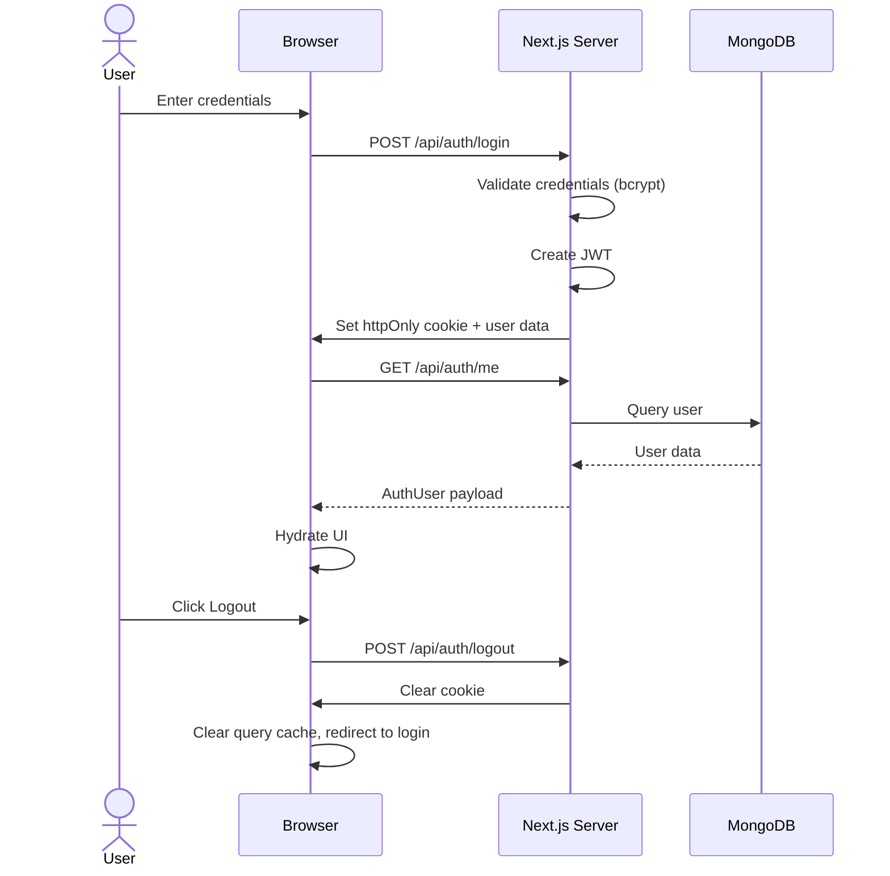
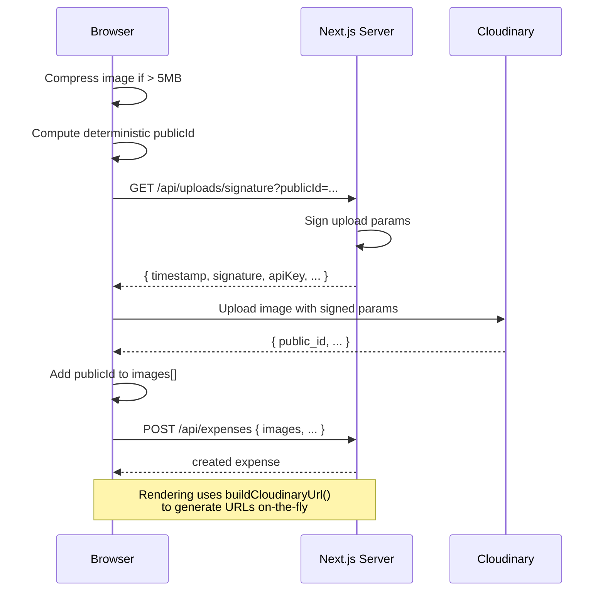
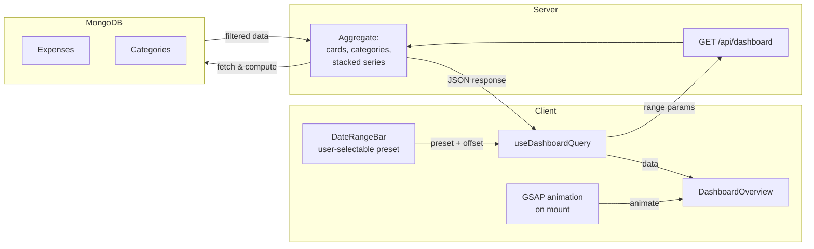

# Architecture

## Frontend Architecture

- **Routing**: Next.js App Router pages in `src/app`; protected routes via middleware.
- **Composition**: Feature-first components under `src/features/*`; reusable UI in `src/components/ui`.
- **Design System**: CSS custom properties for theming (light/dark), glassmorphism aesthetics, Tailwind CSS v4.
- **Animations**: GSAP for page transitions (`usePageTransition`), staggered `data-animate` entry animations.
- **State**:
  - React Query for remote state and cache invalidation.

## Backend Architecture

- **API**: Route handlers under `src/app/api/*`; dynamic server routes with auth middleware.
- **Validation**: Zod validators in `src/lib/validators.ts`; centralized error schema.
- **Business Logic**: Controllers in `src/controllers`, services in `src/services`.
- **Persistence**: Repositories over Mongoose models.
- **Database**: MongoDB with indexed queries on userId, paidAt, categoryId, and text search.

## Auth Flow

## Upload Flow

## Dashboard & Analytics

## DateTime & Timezone Safety

- `src/lib/datetime.ts` exports timezone-safe utilities:
  - `getLocalDateTimeInputValue(date)`: corrects offset and returns `YYYY-MM-DDTHH:mm` for datetime-local inputs.
  - `toUtcIsoString(input)`: converts local input → UTC ISO for storage.
  - `formatDateTime(value, locale, timeZone)`: formats using Intl.DateTimeFormat (respects locale and timezone preference).

## Export & Upload Naming

- `src/lib/naming.ts` ensures deterministic, production-safe filenames:
  - `buildTimestampedFilename({ baseName, extension, timestamp })`: e.g., `expense_report_1778021200.csv`.
  - `buildUploadPublicId(expenseName, timestamp)`: e.g., `coffee_expense_1778021200`.
- Applied to exports (`/api/export`) and Cloudinary uploads.

## State Management & Caching

- Query-key factory in `src/lib/api/query-keys.ts` (per-domain keys).
- Domain hooks in `src/hooks/api/*` (useDashboardQuery, useExpensesQuery, useCategoriesQuery, etc.).
- Mutations invalidate related cache keys on success (e.g., create expense invalidates expenses and dashboard).
- Optimistic update for create operations; mutation success invalidates related queries.

## PWA

- Root layout includes apple-mobile-web-app meta tags and safe-area CSS env variables.
- Manifest at `public/manifest.webmanifest` configures display, icons, and theme color.

## Folder Structure Rationale

- `lib/api`: tight boundary between UI and backend; centralized domain API clients.
- `lib/cloudinary`: Cloudinary signing, URL generation, and folder configuration.
- `lib/uploads`: client-side compression and validation.
- `lib/datetime`: timezone-safe utilities; used across forms and display.
- `lib/naming`: deterministic filenames for exports and uploads.
- `types`: centralized TypeScript contracts per domain (auth, expense, analytics, etc.).
- `features`: domain-oriented UI (expenses, categories, dashboard, settings).
- `components/ui`: design system; shared, reusable UI components.
- `components/charts`: chart components (bar, line) with time-range support.
- `components/providers`: React context providers (theme, query client, app-level providers).
- `hooks/api`: react-query hooks for each domain; centralize fetching logic and invalidation.
- `repositories`: Mongoose repository pattern; queries and mutations on collections.
- `services`: business logic (auth, audit); stateless and reusable.
- `controllers`: route handler helpers (auth controller only).
- `app/api`: route handlers; endpoints grouped by domain.
- `app/[domain]`: pages for each feature (expenses, categories, dashboard, settings).

## Theme-Aware UI

- `next-themes` manages theme state (light, dark, system).
- CSS custom properties (`var(--color-*)`) define the full color palette; light/dark variants in `.dark` class.
- Glassmorphism: backdrop-blur + semi-transparent backgrounds for header and bottom-nav.
- Skeleton loading uses `--color-surface-muted` for theme-aware shimmer.
- `ToastProvider` passes resolved theme to sonner; toasts adapt to current theme.
