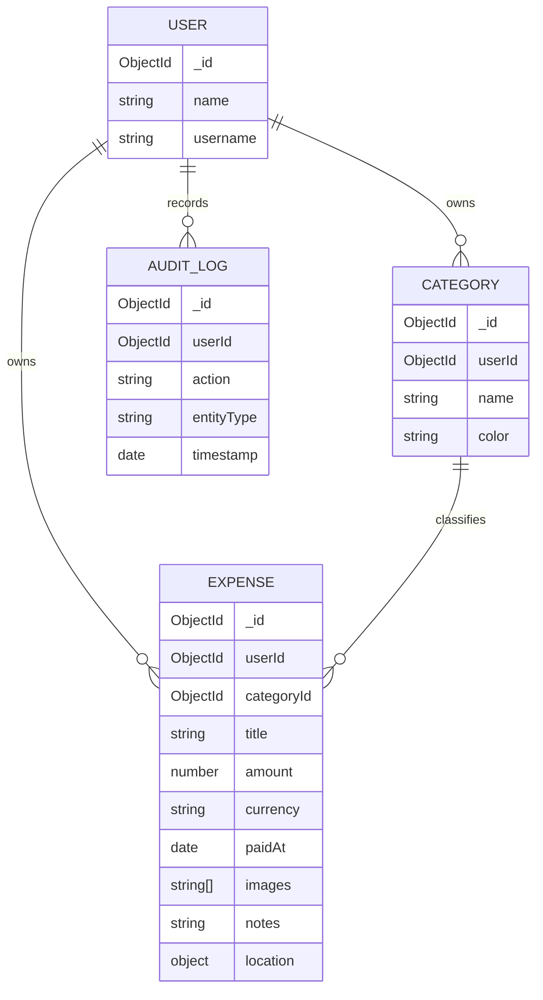

# Database Schema

## Entities

- **User**: identity (locale, timezone, currency).
- **Category**: user-scoped expense classification.
- **Expense**: transaction record with amount/category/time/location/images; includes metadata (notes) and soft-delete flag.
- **AuditLog**: immutable action history (server-only; no UI).

## Relations

- User 1:N Categories
- User 1:N Expenses
- User 1:N AuditLogs
- Category 1:N Expenses

## Indexes & Constraints

- `Category(userId, name)` unique.
- `Expense(userId)` indexed.
- `Expense(categoryId)` indexed.
- `Expense(dateTime)` indexed.
- `Expense(userId, title)` text index.
- `AuditLog(userId)` indexed.
- `AuditLog(timestamp)` indexed.

## Normalization Strategy

- Keep category and user as references for flexible querying.
- Keep location as embedded object within expense for write simplicity.
- Keep image `public_id` strings only to avoid external URL coupling.

## ER Diagram

