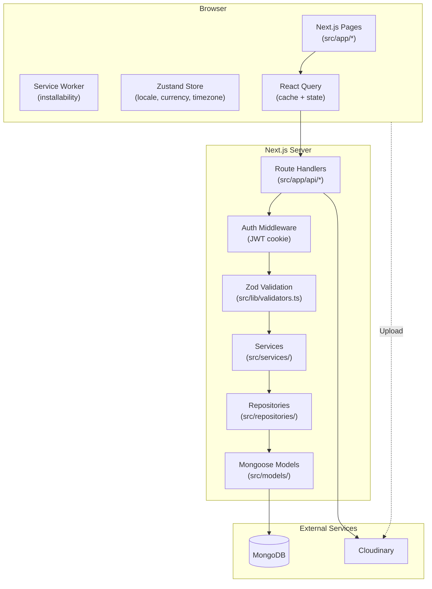

# High Level Design (HLD)

## System Overview

Track My Biryani is a Next.js App Router monolith that serves UI and API routes from the same deployment unit. It supports secure JWT cookie auth, expense and category management, analytics dashboards, and Cloudinary image uploads.

## Core Modules

- **Presentation Layer**: App Router pages, reusable UI primitives, feature components.
- **State Layer**: React Query for server state.
- **API Layer**: Centralized typed API client and domain services (`src/lib/api/*`).
- **Domain Layer**: Controllers/services/repositories with schema validation.
- **Persistence Layer**: MongoDB via Mongoose models and repositories.
- **Media Layer**: Signed Cloudinary uploads with client-side compression/drag-drop support.

## Key Architecture Decisions

1. Keep server/API and frontend in one Next.js app for fast iteration and low operational complexity.
2. Use cookie-based JWT auth for secure session persistence and middleware route gating.
3. Use Zod for request + environment validation and fail-fast startup behavior.
4. Keep data access in repositories to isolate query logic from handlers.

## Scalability Notes

- Query-key based cache invalidation keeps UI updates efficient.
- Repository layer can be replaced by dedicated services without rewriting UI.
- Export API streams structured data in JSON format for downstream integrations.
- Cloudinary offloads media storage and transformations from app servers.
