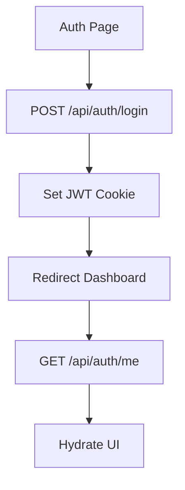
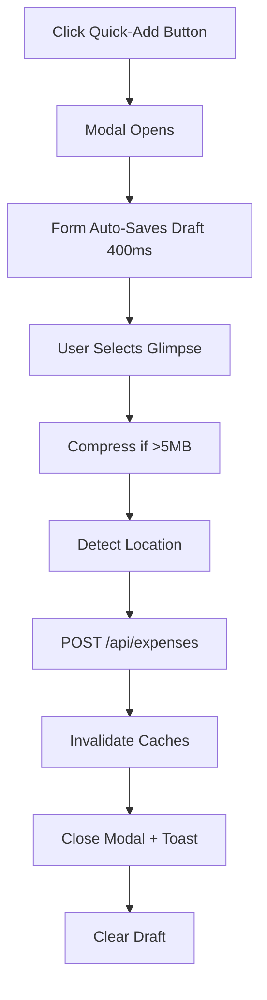
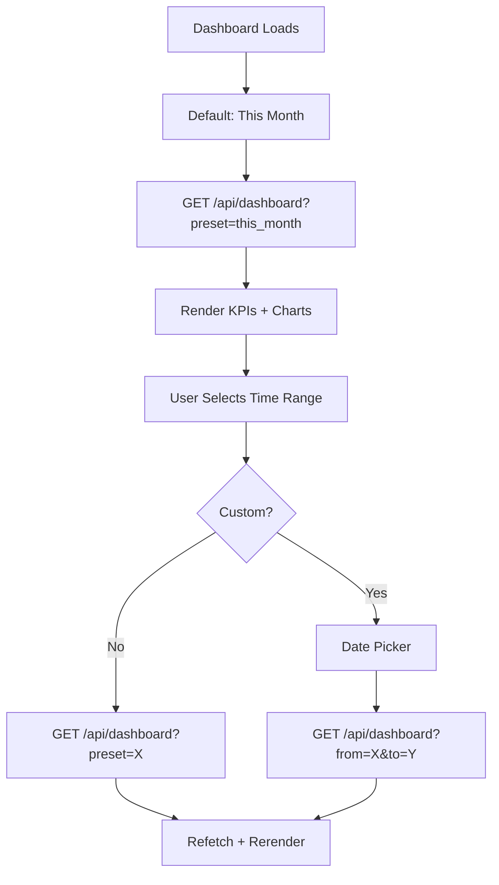
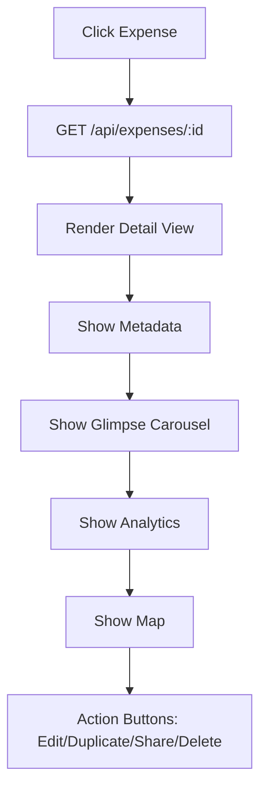
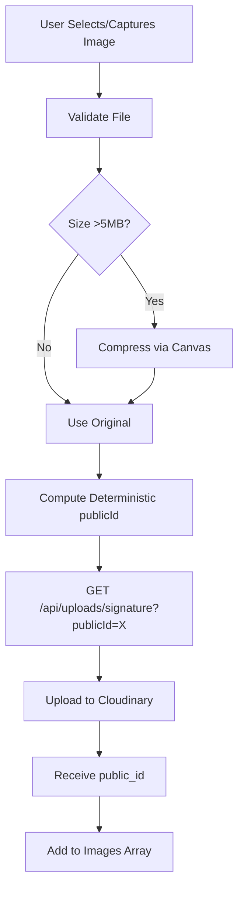

# UX Guide

## User Journeys

1. **Authentication**: Signup/login redirects to dashboard.
2. **Quick Add**: Click quick-add button (fixed bottom-right on mobile, desktop) → modal opens → form auto-saves draft → submit records expense with glimpses.
3. **Dashboard**: View KPIs, category breakdown, and trends for selected time range (this week/month/year or custom).
4. **Expense Details**: Click expense → view full metadata (notes, payment method, tags), glimpse carousel, location map, and analytics (category percentile, contribution to week/month/year).
5. **Expense Management**: Search, filter, sort expenses → inline quick actions (view, edit, delete).
6. **Category Management**: Browse categories → view analytics (total spending, trends) → edit/delete.
7. **Settings**: Configure locale, timezone, currency, theme → export/import data → view audit logs.

## Quick Add Modal Flow

- **Draft Autosave**: Form values + selected images auto-save to localStorage (debounced 400ms) while modal is open.
- **Restore on Reopen**: If user closes quick-add and reopens, draft is restored.
- **Camera Support**: On mobile, camera input defaults to `capture="environment"` (rear camera); fallback to file picker on desktop or if device lacks camera API.
- **Glimpse Upload**: Client-side compression (> 5MB), deterministic naming, and Cloudinary signed upload with progress indicator.
- **Location**: Auto-detects geolocation on submit; user can override address field.

## Dashboard Analytics

- **Time Range Selector**: Buttons for "This Week", "This Month", "This Year", "Custom".
- **Custom Range**: Date picker shows from/to inputs; clicking "Apply" re-fetches dashboard data.
- **KPI Cards**: Display total spending, weekly spend, daily average, and top category; update reactively for selected range.
- **Charts**: Category breakdown (pie), daily trend (line), and weekly spend (bar); regenerate on range change.
- **Chart Export**: Icon button (download) on each chart → exports as PNG with timestamped filename (e.g., `category_breakdown_1778021200.png`).

## Responsive Behavior

- **Mobile**: Bottom navigation, full-screen quick-add modal, stacked cards, single-column tables.
- **Tablet**: Two-column grid for KPI cards, resizable charts.
- **Desktop**: Multi-column layout, charts side-by-side, expanded tables with inline actions.
- **Gestures**: Touch-friendly buttons, swipe scroll for tables.

## Theme & Toasts

- **Theme Toggle**: Header includes theme toggle (light/dark); theme preference persists in localStorage.
- **Toasts**: Success/error/info notifications appear top-right with theme-aware styling (adapts to current light/dark mode).
- **Animations**: Page transitions use GSAP for smooth enter/exit (fade-scale); charts animate on render.

## Accessibility

- **Keyboard Navigation**: All buttons and links accessible via Tab; modals close on Escape.
- **ARIA Labels**: Interactive elements include aria-label, aria-describedby where needed.
- **Focus Management**: Modal gets focus trap on open; focus returns to opener on close.
- **Screen Readers**: Form labels and error messages are semantic; status updates announced.
- **Color Contrast**: Theme colors meet WCAG AA standards.

## Loading & Error States

- **Skeleton Loading**: Dashboard and list pages show loading cards before data resolves.
- **Upload Progress**: Glimpse upload shows per-file progress bar; failed uploads show retry button.
- **Error Toasts**: Failed API calls toast with error message; user can retry.
- **Empty States**: Lists show "No expenses" or "No categories" with call-to-action button.
- **Not Found**: 404 page with link back to dashboard.

## Mermaid Flows

### Auth Flow

### Quick Add Expense Flow

### Dashboard Time-Range Flow

### Expense Detail Flow

### Glimpse Upload Flow

