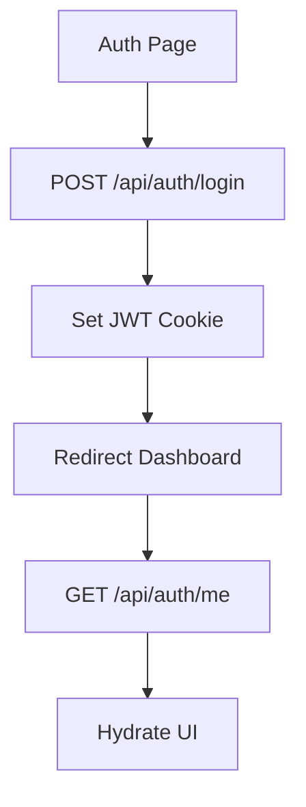
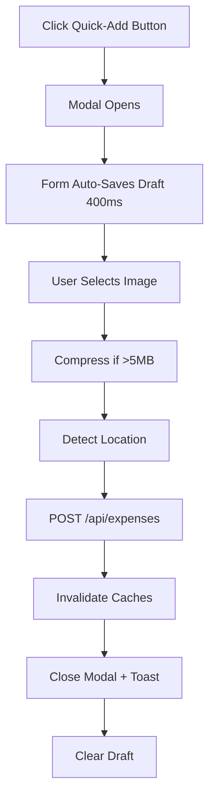
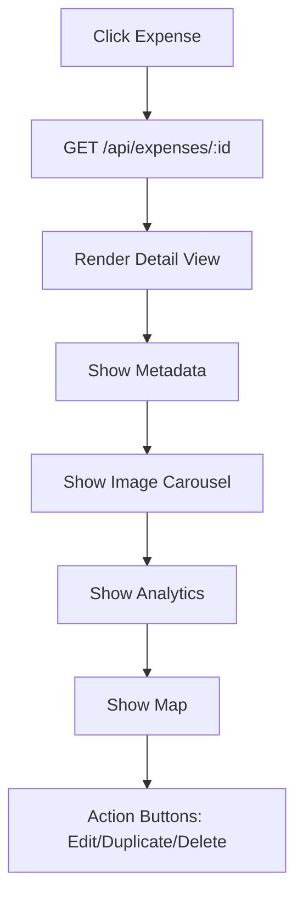
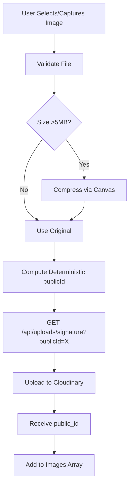

# UX Guide

## User Journeys

1. **Authentication**: Signup/login redirects to dashboard.
2. **Quick Add**: Click quick-add button → modal opens → form auto-saves draft → submit records expense.
3. **Dashboard**: View KPIs, category breakdown, and trends.
4. **Expense Details**: Click expense → view full metadata (notes), image carousel, location map.
5. **Expense Management**: Search, filter, sort expenses → inline quick actions (view, edit, delete).
6. **Category Management**: Browse categories → create/edit/delete.

## Quick Add Modal Flow

- **Draft Autosave**: Form values + selected images auto-save to localStorage (debounced 400ms) while modal is open.
- **Restore on Reopen**: If user closes quick-add and reopens, draft is restored.
- **Camera Support**: On mobile, camera input defaults to `capture="environment"` (rear camera); fallback to file picker on desktop or if device lacks camera API.
- **Image Upload**: Client-side compression (> 5MB), deterministic naming, and Cloudinary signed upload with progress indicator.
- **Location**: Auto-detects geolocation on submit; user can override address field.

## Dashboard Analytics

- **Range**: Dashboard uses a fixed default range (`this_month`); no user-selectable range selector.
- **KPI Cards**: Display total spending, weekly spend, daily average, and top category via a swipeable carousel.
- **Charts**: Category breakdown (pie) and daily trend (line/bar).

## Header Controls

- **Theme Toggle**: Light/dark switch in the header.
- **Login/Logout**: Authenticated users see their name + logout button; guests see a Login button.

## Navigation

- **Bottom Nav**: Three-tab pill-style navigation (Dashboard, Expenses, Categories) with chiclet active indicator.
- **Safe Area**: PWA safe-area padding for notched devices.

## Responsive Behavior

- **Mobile**: Bottom navigation, full-screen quick-add modal, stacked cards, single-column layout.
- **Tablet**: Two-column grid for KPI cards.
- **Desktop**: Multi-column layout, charts side-by-side.

## Theme & Visual Design

- **Design System**: CSS custom properties for colors, shadows, and radii. Glassmorphism header/nav with backdrop blur.
- **Theme Toggle**: Header includes theme toggle (light/dark); theme preference persists in localStorage.
- **GSAP Animations**: Page shell fades + scales in on mount. Elements with `[data-animate]` stagger in with configurable delays.
- **Reduced Motion**: Respects `prefers-reduced-motion: reduce` — animations are skipped.

## Accessibility

- **Keyboard Navigation**: All buttons and links accessible via Tab; modals close on Escape.
- **ARIA Labels**: Interactive elements include aria-label, aria-describedby where needed.
- **Focus Management**: Modal gets focus trap on open; focus returns to opener on close.
- **Screen Readers**: Form labels and error messages are semantic; status updates announced.
- **Color Contrast**: Theme colors meet WCAG AA standards.

## Loading & Error States

- **Skeleton Loading**: Dashboard and list pages show loading cards before data resolves.
- **Upload Progress**: Image upload shows per-file progress bar; failed uploads show retry button.
- **Error Toasts**: Failed API calls toast with error message; user can retry.
- **Empty States**: Lists show "No expenses" or "No categories" with call-to-action button.
- **Not Found**: 404 redirects to dashboard.

## Mermaid Flows

### Auth Flow

### Quick Add Expense Flow

### Expense Detail Flow

### Image Upload Flow

