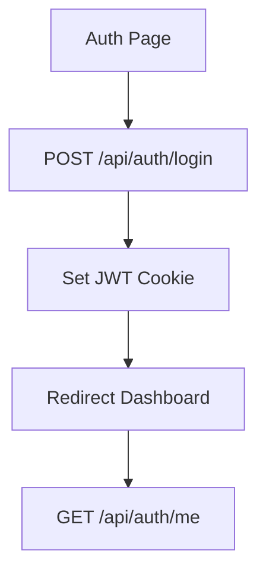
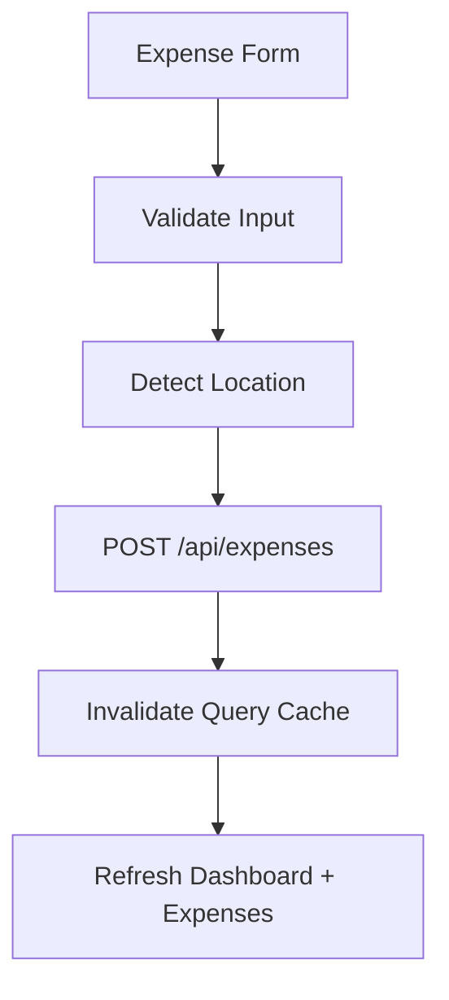
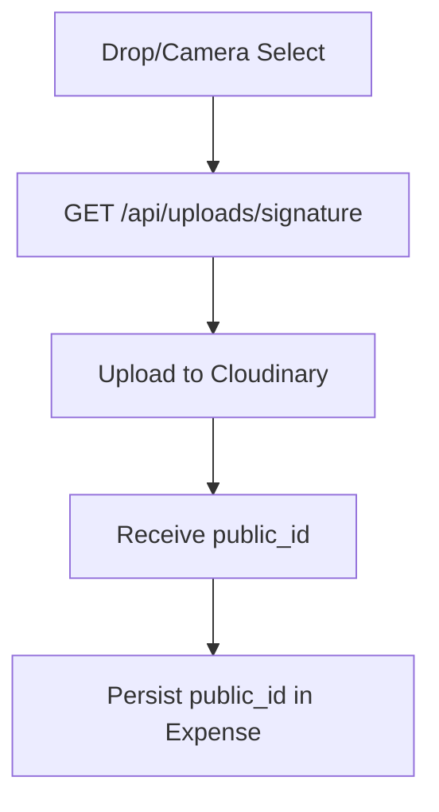
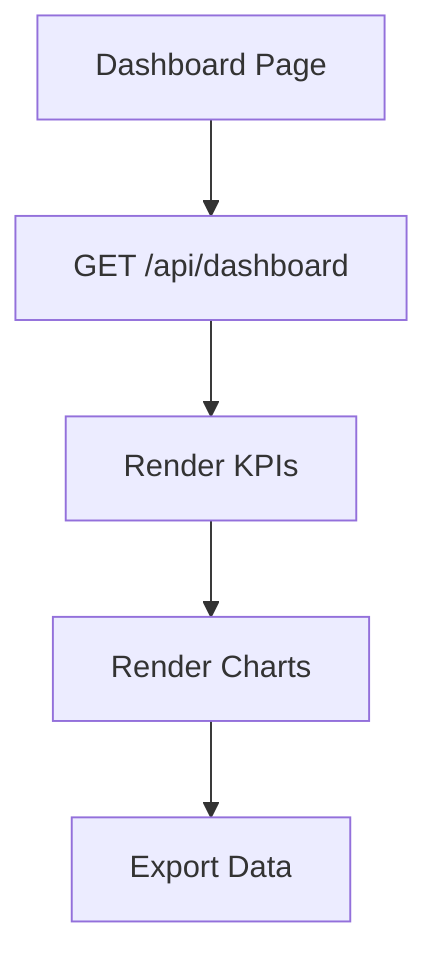

# UX Guide

## User Journeys
- Signup/login and land on dashboard.
- Add expenses quickly with category + receipt upload.
- Review analytics charts and recent activity.
- Manage categories.
- Configure locale/currency/timezone/theme.
- Export/import data.

## Empty/Loading/Error States
- Dashboard and lists render loading cards before data resolves.
- Uploads show progress and retry UI.
- Forms show toast feedback on failures and success.

## Responsive Behavior
- Mobile-first spacing and bottom navigation on small screens.
- Cards and grids collapse to single-column where needed.

## Mermaid Flows
### Auth Flow

### Expense Creation Flow

### Upload Flow

### Dashboard Flow

